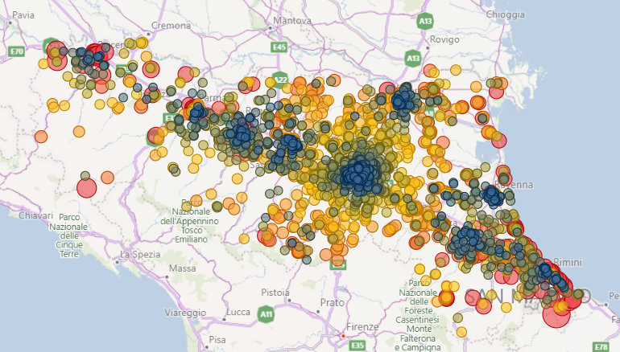
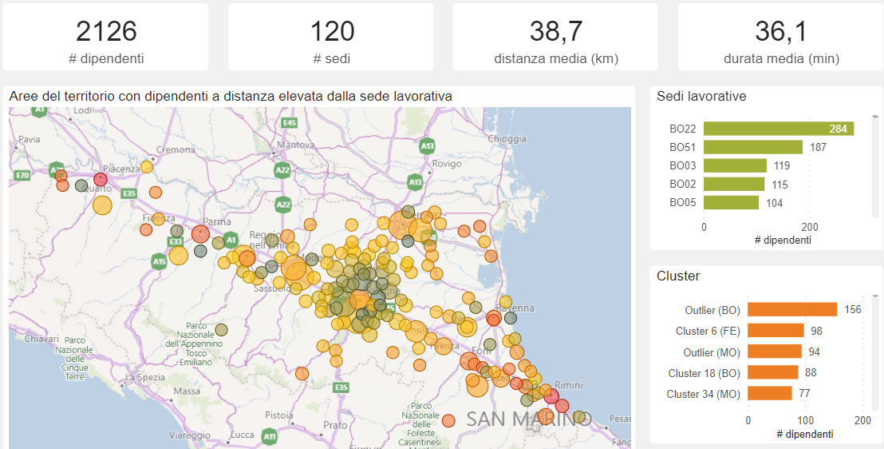
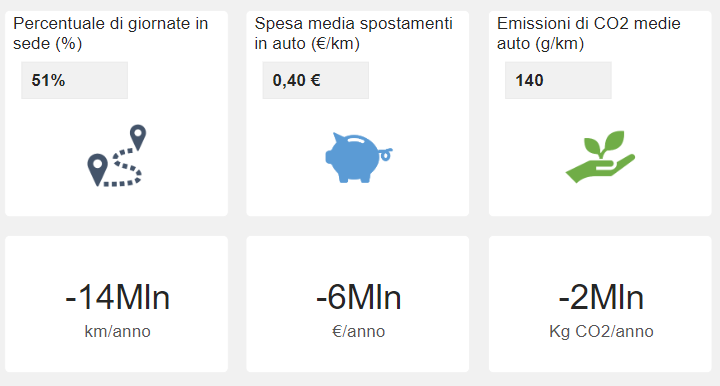

# Intelligent Digital Workspace in the Era of Smart Working
Identification of the optimal location of co-working spaces using clustering methods.
Notebook and source code repository of the solution use case.

## Description
The solution was developed to support decision makers in optimize work travels and reduce costs and incurred by employee of Regione Emilia-Romagna and Agenzia per il Lavoro (Regione Emilia-Romagna).

How the repository is organised:
- notebooks: notebooks used to develop solution
- docs: any report or technical documentation of solution implementation

The implementation uses a distributed computation engine (Apache Spark) to speed-up performance on simulation and external API (Open Source Routing Machine) to obtain distance and travel time between  workplaces and employees' addresses. Simple data transformation are performed in order to re-shape data in a useful way using python most famous library pandas. Clustering analysis is performed with SciKit-Learn python library.

Output can be consumed via every common BI tool.







## Installation
A list of requirements is attached to this repository in order to run notebooks inside a Python environment.
We suggest install libraries within a virtual enviroment.

```{bash}
$ python -m venv myvenv
$ source myvenv/bin/activate
$ pip install -r requirements.txt
```

## Usage
In order to adapt the solution to your business case notebook have to be excuted. 

- 01_Ingest.ipynb notebook shows how to ingest, clean, format and standardise data in order to perform the analysis.
- 02_Cluster.ipynb notebook perform cluster analysis of employees' geo-location and choose optimal configuration. 
- 03_Simulate.ipynb notebook calcutate distances and duration for employee/workplace pairs.


## Support
Contact the authors for informations about the project. 

## Report
[Documentation](docs/Data%20Analytics%20Lab%20-%20Workstation%20Intelligence%20-%20Relazione_1.0%20-%20Eng%20ver.pdf) 

## Authors and acknowledgment
Andrea Iacobucci, Serena Borsari, Luca Bonafede

## License
[MIT](LICENSE.md)

## Project status
The project is still active and under development for future improvements.